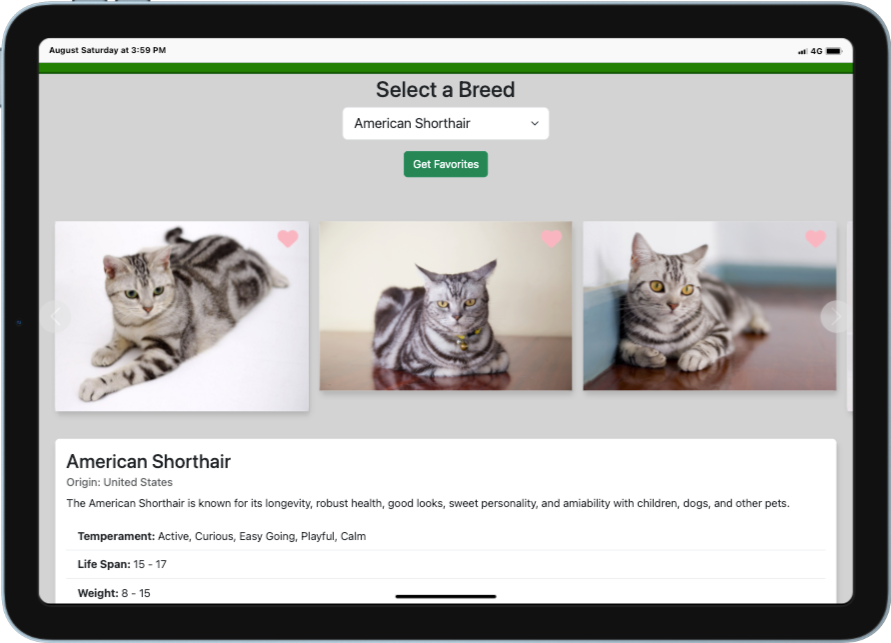

# 🐈 🐈‍⬛ Cat Explorer App

A web application that allows users to explore different cat breeds, view images, and manage their favorite cat photos using The Cat API.

## 🌐 Live at: <a href="https://doumbiasoft.github.io/cat-explorer/" title="Try Demo" target="_blank">Try Demo</a>

[](https://doumbiasoft.github.io/cat-explorer/)

## 🚀 Features

- **Breed Selection**: Browse and select from various cat breeds
- **Image Carousel**: View multiple images for each selected breed
- **Breed Information**: Display detailed information about each breed including:
  - Origin, description, temperament
  - Life span, weight, adaptability ratings
  - Intelligence, energy level, grooming needs
  - Links to Wikipedia and Vetstreet resources
- **Favorites System**: Add/remove images to/from favorites with heart icon toggle
- **Progress Tracking**: Visual progress bar and cursor feedback during API requests
- **Request Timing**: Console logging of request duration

## 🛠️ Technologies Used

- **Frontend**: Vanilla JavaScript (ES6+), HTML5, CSS3, Bootstrap
- **HTTP Client**: Axios with interceptors for request/response handling
- **API**: The Cat API (thecatapi.com)
- **UI Components**: Bootstrap Carousel for image navigation

## 📈 API Endpoints Used

All endpoints use base URL: `https://api.thecatapi.com/v1`

### ⚡️ GET Endpoints

- `GET /breeds` - Retrieve list of all cat breeds
- `GET /images/search?breed_id={id}&limit=20` - Get images for specific breed
- `GET /favourites?sub_id={user_id}` - Get user's favorite images
- `GET /images/{image_id}` - Get complete image data with breed information

### 🔨 POST Endpoints

- `POST /favourites` - Add image to favorites
  ```json
  {
    "image_id": "string",
    "sub_id": "string"
  }
  ```

### 🗑️ DELETE Endpoints

- `DELETE /favourites/{favourite_id}` - Remove image from favorites

## 🔗 Request/Response Features

- **Interceptors**: Automatic request timing and progress tracking
- **Progress Bar**: Visual feedback during API calls
- **Cursor State**: Changes to "progress" during requests
- **Error Handling**: Comprehensive try-catch blocks with console logging
- **Optimistic UI**: Real-time heart toggle for favorites

## 📂 File Structure

- `index.mjs` - Main application logic and API calls
- `Carousel.mjs` - Carousel component with favorite functionality
- `index.html` - HTML structure and templates
- `styles.css` - Custom styling

## 📚 Usage

1. Select a cat breed from the dropdown
2. Browse images in the carousel
3. Click heart icons to add/remove favorites
4. Click "Get Favourites" to view your saved images
5. Monitor console for request timing and progress updates
